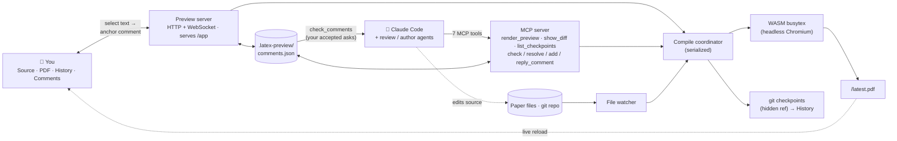

# MagicTeX — LaTeX Editor for AI Agents

<!-- badges -->
[](https://www.npmjs.com/package/magictex-mcp)
[](https://registry.modelcontextprotocol.io)
[](https://github.com/ZoeLinUTS/MagicTeX-mcp/actions/workflows/ci.yml)
[](https://github.com/ZoeLinUTS/MagicTeX-mcp/stargazers)
[](https://github.com/ZoeLinUTS/MagicTeX-mcp/commits/main)
[](LICENSE)
[](https://github.com/sponsors/ZoeLinUTS)

**English** · [简体中文](docs/i18n/README.zh-CN.md) · [日本語](docs/i18n/README.ja.md) · [한국어](docs/i18n/README.ko.md) · [Español](docs/i18n/README.es.md) · [Français](docs/i18n/README.fr.md) · [Deutsch](docs/i18n/README.de.md) · [Português](docs/i18n/README.pt.md)

**MagicTeX** is a **LaTeX editor built for AI agents** — an Overleaf-like
one-window workspace for Claude Code, served by an MCP server, with **no local TeX
install and no Overleaf account**: live PDF preview, a source editor with a Visual
(WYSIWYG) mode, change history, and **comments you anchor on the rendered PDF that
become edit instructions for the agent**. (npm package: `magictex-mcp`.)

It compiles with a WASM TeX Live 2026 engine ([texlyre-busytex](https://github.com/TeXlyre/texlyre-busytex))
running inside a headless browser, so there's nothing multi-gigabyte to install —
just a one-time WASM asset download.


## See it before you install

A guided walkthrough of the comment → agent loop lives at
**[zoelin.dev/tools/magictex](https://zoelin.dev/tools/magictex)**, built from real
tool output. It's a replay, not a hosted instance — the TeX engine is a one-time
~650 MB download and the agent half is Claude itself, so MagicTeX runs next to your
project rather than in a web page.

## The workspace

One browser window (inspired by Typst's one-surface editor and LiquidText's
anchored annotations):

```
┌──────────────────────────────────────────────────────────────┐
│  ✓ up to date · 13 pages        Export .zip · Download PDF   │
├────────────┬──────────────────────────────┬──────────────────┤
│ Source /   │          PDF (live)          │    Comments      │
│ History    │  select text → 💬 comment    │  accepted → ask  │
│  editor,   │  highlights stay anchored    │  Claude to       │
│  timeline  │  auto-reloads on every edit  │  address them    │
│  + diffs   │                              │  → resolved ✓    │
└────────────┴──────────────────────────────┴──────────────────┘
```

- **Comment → Claude loop (the point of it all).** Review the *rendered* document
  like a supervisor marking up a printout: select text, attach a comment
  ("tighten this paragraph"). Then tell Claude to *"address my comments"* — it
  pulls them via `check_comments` as **located work items** (page + quoted passage
  + the source `file:line` it anchors to + your ask), edits the source, and
  resolves each card with a note. You interact with the document; Claude interacts
  with the source. Run it hands-off with `/loop` — see
  [`docs/AGENT-LOOP.md`](docs/AGENT-LOOP.md).
- **Editable source panel.** A CodeMirror LaTeX editor with the project's files —
  save (Ctrl+S) recompiles and refreshes the PDF, Typst-style. Or keep using your
  own editor: any save triggers the same live loop.
- **Live reload.** A file watcher recompiles on every save — Claude's edits, the
  built-in editor's, or your external editor's.
- **Change history.** Each successful compile is auto-snapshotted to a **hidden
  git ref** (`refs/latex-preview/checkpoints`) — never touching your branches,
  `git log`, or working tree. The History tab shows the timeline and each
  checkpoint's colorized diff beside the PDF.
- **Get to Overleaf.** **Download PDF**, **Export .zip** (clean build-inputs
  bundle), and a one-click **Open in Overleaf** link for public GitHub repos;
  Premium Git-bridge sync is a documented `git push`. See [`docs/USER-GUIDE.md`](docs/USER-GUIDE.md).
- **Review workflow (reviewer → gate → resolver).** A reviewer/defender agent posts
  comments via `add_comment`; you **Accept/Reject** them (or flip *Auto-accept* for
  copilot mode); an author loop resolves the accepted ones. Comments carry roles and
  a reply thread. See [`docs/AGENT-LOOP.md`](docs/AGENT-LOOP.md).
- **Save vs. recompile, your call.** The built-in editor auto-saves every 30s without
  recompiling; **Ctrl+S** / **Save** / **Recompile** rebuild the PDF on demand. (Flip
  **⚡ Live** for recompile-as-you-type.) Your own editor and Claude's edits still
  auto-recompile via the watcher.
- **Real projects.** Auto-detects the main file, gathers multi-file
  `\input`/`\include`, `.bib`, in-repo `.cls`/`.sty`/`.bst` and figures, runs
  BibTeX and reruns when needed; common missing packages are auto-injected.
- **Compile backend.** Uses your local **latexmk** when you have one — full package
  fidelity, output matching Overleaf — and the bundled zero-install **WASM** TeX Live
  when you don't. Force either with `backend: "system"` / `"wasm"`. Every compile
  reports which one ran.
- **Document classes.** `IEEEtran` is bundled, because no venue class ships in the
  WASM TeX Live and a missing class can't be worked around the way a package can.
  Conference classes (NeurIPS, ICML, CVPR, ACL, AAAI …) carry no redistributable
  licence, so put the `.cls` from the author kit beside your source — it's picked up
  automatically.
- **MCP tools:** `render_preview` (compile + open the workspace), `check_comments` /
  `resolve_comment` / `add_comment` / `reply_to_comment` (the review loop), `show_diff`
  (side-by-side diff as an image — useful on image-capable clients).
- **Actionable errors.** Failed compiles return parsed `{file, line, message}`
  errors so Claude can self-correct, and show in the workspace.

## Setup

MagicTeX is on npm as [`magictex-mcp`](https://www.npmjs.com/package/magictex-mcp) and
listed in the [official MCP registry](https://registry.modelcontextprotocol.io) as
**`io.github.ZoeLinUTS/magictex`** — so any client that reads the registry can find it.
There's nothing to clone and no TeX install; `npx` fetches it on first use.

1. **Add it to your paper project's `.mcp.json`** (see [`.mcp.json.example`](.mcp.json.example)):

   ```json
   {
     "mcpServers": {
       "magictex": { "command": "npx", "args": ["-y", "magictex-mcp"] }
     }
   }
   ```

   For local development from a clone, point it at the source instead:
   `"command": "npx", "args": ["tsx", "/absolute/path/to/magictex-mcp/src/server.ts"]`

2. **Restart Claude Code** (or `/mcp` reconnect) so it picks up the server.

3. **Ask Claude to render.** e.g. *"render a preview of this paper"* → the first call
   downloads the WASM TeX Live assets (~650 MB, one time), compiles, and opens the
   live preview tab. Subsequent edits reload it automatically.

The WASM assets are **not** in this repo. They're fetched on first run into a
per-user cache — `~/Library/Caches/magictex` on macOS, `$XDG_CACHE_HOME/magictex`
on Linux, `%LOCALAPPDATA%\magictex` on Windows — so upgrading MagicTeX doesn't
re-download them, and a checkout, a global install and an `npx` run share one copy.
Set `MAGICTEX_ASSETS_DIR` to put them elsewhere. To pre-fetch:
`npx texlyre-busytex download-assets <that directory>`.

Each server picks a free port for its workspace, so sessions in different projects
never clash. Set `MAGICTEX_PORT` to pin one instead — e.g. for a development checkout, so
its URL is recognisable and the workspace's own settings (panel widths, Live, Visual)
persist; refresh the tab after a restart. If that port is taken, the server falls back to
a free one and logs which. A window left open from an earlier server never writes into a
newer one on the same port.

## Install as a Claude Code plugin (slash commands)

For a low-typing workflow, install MagicTeX as a plugin — one install gives you the
MCP server **and** the slash commands:

```
/plugin marketplace add ZoeLinUTS/MagicTeX-mcp
/plugin install magictex
```

Then, in your paper project, use the **workflow commands** for the common flows:

- **`/magic-latex`** — compile and open the workspace (the live preview).
- **`/ai-review [skill]`** — review the paper with a skill (default
  `academic-paper-revision`; pass any skill name) and post comments for you to
  Accept/Reject. Missing skills are reported with an install hint.
- **`/address-comments`** — resolve your accepted comments (loop it with
  `/loop 60s /address-comments`).
- ⚡ **`/ultra-agents [skill] [depth]`** — fully autonomous: review, auto-accept, fix,
  repeat, up to `depth` rounds (default 2), stopping early the moment a round finds
  nothing new. No per-round approval — that's the point, and the risk. `depth > 5`
  asks you to confirm before starting. Ends with a summary (what was raised, what
  changed, which checkpoints to look at) — every round is still an ordinary,
  revertible checkpoint. See [`docs/AGENT-LOOP.md`](docs/AGENT-LOOP.md#ultra-agents).

### One command per tool

Every MCP tool also has a slash command with the **same name**, so you can drive any
single step by typing the tool name. The rule to teach: *the tool is `X` → type
`/X`.*

| Type this      | Runs tool         | What it does |
| -------------- | ----------------- | ------------ |
| `/render_preview` | `render_preview` | Compile the paper and open/refresh the live preview. |
| `/check_comments` | `check_comments` | List the comments you've accepted, as edit instructions (no edits yet). |
| `/resolve_comment [id] [note]` | `resolve_comment` | Mark a comment done after the edit; it turns **green** for your review. |
| `/add_comment ["quote"] [note]` | `add_comment` | Anchor a comment onto a passage for you to Accept/Reject. |
| `/reply_to_comment [id] [text]` | `reply_to_comment` | Add a threaded reply to a comment. |
| `/show_diff [checkpoint]` | `show_diff` | Side-by-side visual diff as an image (current changes, or a checkpoint). |
| `/list_checkpoints [limit]` | `list_checkpoints` | Recent checkpoints with their sha, newest first — find one to pass into `/show_diff`. |

You never *have* to type these — plain English works too (*"render a preview"*,
*"address my comments"*). The commands are just a fast, teachable shorthand.

> The plugin bundles the MCP server (`npx magictex-mcp`), so installing the plugin is
> all you need — the `.mcp.json` above is the alternative if you'd rather not install
> a plugin. The slash commands work either way.

## Tools

The MCP surface, for any client that speaks MCP. (In Claude Code you can just ask in
plain English, or use the slash commands above — these are the underlying tools.)

| Tool | Parameters | What it does |
| ---- | ---------- | ------------ |
| `render_preview` | `mainFile?` · `engine?` (`pdflatex` \| `xelatex` \| `lualatex`, default `xelatex`) · `backend?` (`wasm` \| `system` \| `auto`, default `auto` — local latexmk if installed, else the bundled WASM engine) | Compiles the project and opens/refreshes the live workspace. The main file is auto-detected by scanning for `\documentclass` if omitted. |
| `check_comments` | `includeResolved?` (default `false`) | Returns the accepted comments as located work items — page, quoted passage, the source `file:line`, and the ask. Reviewer suggestions awaiting your decision are reported but not returned as work. |
| `add_comment` | `quote` · `comment` · `role?` (`reviewer` \| `defender`) · `page?` · `accepted?` | Anchors a comment onto a passage. Posts as a *suggestion* awaiting your Accept/Reject unless `accepted` is set — that flag is what makes autonomous mode autonomous. |
| `resolve_comment` | `id` · `note` | Marks a comment done after the edit, with one line describing what changed. It turns **green** in the workspace for your review. |
| `reply_to_comment` | `id` · `text` · `role?` (`author` \| `reviewer` \| `defender`) | Adds a threaded reply, so a disagreement can be worked out on the comment instead of in chat. |
| `show_diff` | `checkpoint?` | Renders a side-by-side diff **as an image**, shown inline in the conversation. Defaults to the current uncommitted changes; pass a checkpoint sha for a saved version. |
| `list_checkpoints` | `limit?` (default 10, max 50) | Recent checkpoints with their sha, newest first — use it to find one to pass to `show_diff`. |

**The headline workflows are built on top of these, not among them.** `/magic-latex`,
`/ai-review`, `/address-comments` and ⚡ `/ultra-agents` are Claude Code plugin
commands that orchestrate the tools above — `/ultra-agents` chains review →
auto-accept → fix for as many rounds as you allow, and is the reason `add_comment`
takes an `accepted` flag. They are not part of the MCP surface, so another MCP client
sees the seven tools only. See [the plugin section](#install-as-a-claude-code-plugin-slash-commands)
and [docs/AGENT-LOOP.md](docs/AGENT-LOOP.md).

## See it in the terminal

These are real tool outputs, captured verbatim from an actual run against the sample
paper — not mocked up. This is what you see in Claude Code while the browser
workspace (screenshot above) reflects the same state live.

You type:
```
/magic-latex
```
Claude calls `render_preview` and replies:
```
✓ Compiled main.tex with xelatex in 1900ms — 2 files. Workspace (live preview,
source editor, history, PDF comments — auto-reloads on edits):
http://127.0.0.1:52042/app
```

You (or a reviewer skill) leave a comment, then ask what's ready to act on. Claude
calls `check_comments`:
```
1 accepted comment — edit each at its source location per the instruction, then
call resolve_comment with its id and a one-line note:

[id: 2fce9e3c8b5f] p.1 — "Sorting widgets efficiently is a long-standing problem"
  ↳ source: main.tex:15
  → Tighten this opening sentence.

(1 reviewer suggestion still awaits the human's accept in the workspace — not
actionable yet.)
```
Claude makes the edit and calls `resolve_comment`:
```
✓ Resolved comment 2fce9e3c8b5f ("Sorting widgets efficiently is a long-standing
problem…") — the card now shows: Rewrote the opening sentence.
```
Ask again, and the accepted queue is empty — only the still-unaccepted suggestion
remains, waiting on you:
```
No accepted comments. (2 already resolved.)

(1 reviewer suggestion still awaits the human's accept in the workspace — not
actionable yet.)
```

## How it works

```
Claude edits .tex ─┐
 file watcher ─────┼─▶ compile coordinator ─▶ headless Chromium ─▶ WASM TeX ─▶ PDF
 render_preview ───┘         (serialized)         (engine host)                │
                                                                               ▼
                     your workspace (/app)  ◀── WebSocket "reload" ◀── local HTTP server
                     Source · PDF · History · Comments        (serves /app + /latest.pdf)
```

The WASM engines need DOM/Worker globals, so the server hosts a hidden headless
Chromium as its compile worker; the workspace *you* open is a lightweight React +
pdf.js app with no WASM in it. See [`docs/ARCHITECTURE.md`](docs/ARCHITECTURE.md).



Both front doors — you in the workspace, agents through the 7 MCP tools — meet at
the same coordinator, comment store, and git history. You act on the *rendered
document* (anchor a comment); Claude acts on the *source* (reads your comments via
`check_comments`, edits, `resolve_comment`). That shared substrate is what makes
the comment loop, the review workflow, and traceable history possible.

## Requirements

- Node 20.19+ (the floor `chokidar` and `playwright` actually need; the server checks at startup and says so)
- Playwright's Chromium (installed automatically; ~150–300 MB) — or set it to reuse
  your installed Chrome.
- ~650 MB disk for the one-time WASM TeX Live assets — all of it fetched on the
  first run, in three package sets (basic 87 MB, recommended 190 MB, extra 324 MB,
  plus the 31 MB engine). A normal paper only *loads* the basic set; the larger two
  sit on disk until something needs them. Cached per user, not per install, so
  upgrading MagicTeX doesn't re-download them. Override the location with
  `MAGICTEX_ASSETS_DIR`.
- **A local TeX install is optional.** See below for when it matters.

### Do I need a local TeX distribution?

No — the bundled WASM engine compiles with nothing installed, which is the whole
point. But it ships a *subset* of TeX Live, so some things aren't in it: `svg`,
most venue document classes, and various less common packages. When one is
missing you'll be told, rather than handed a silently wrong PDF.

Install a distribution when you want output that matches Overleaf exactly.
MagicTeX picks it up on its own — no configuration:

| | |
|---|---|
| macOS | [MacTeX](https://tug.org/mactex/) |
| Linux | `texlive-full`, via your package manager |
| Windows | [TeX Live](https://tug.org/texlive/), or [MiKTeX](https://miktex.org/) **plus** [Strawberry Perl](https://strawberryperl.com/) |

> `latexmk` is what MagicTeX looks for on `PATH`, but it isn't something you
> install on its own — it's a driver script that comes inside the distributions
> above. Check with **`latexmk -version`**, not `which latexmk`: `latexmk` is a
> Perl script, and MiKTeX puts `latexmk.exe` on your `PATH` without shipping a
> Perl to run it with — so the file is found and still cannot execute. On macOS
> you may need `eval "$(/usr/libexec/path_helper)"` or a fresh terminal first.

Every compile tells you which one ran — `xelatex · system` or `xelatex · wasm`.

## Development

```bash
npm install
npm run typecheck    # tsc for the server and the UI
npm run build:ui     # build the React workspace to ui/dist
npm test             # the unit suite — engine-free, no browser, seconds
npm start            # run the server on stdio (for a manual MCP client)
```

Two tiers, on purpose. `npm test` covers the comment store, anchor matching, line
and column geometry, the history repo, asset paths, compile-log classification, the
preview server's shutdown, and an MCP workflow E2E — all without a browser or a TeX
engine, so it stays fast and deterministic. CI (`.github/workflows/ci.yml`) runs
typecheck + UI build + that suite on Node 20 and 22 for every push and pull request.

The things a unit test structurally cannot see — highlight geometry at several zoom
levels, what a failed render actually tells the reader, whether shutting down closes
the server and warns any open window — live in `scripts/smoke-*.mjs` and run against
a real browser and a real compile in `.github/workflows/smoke-macos.yml`. Each of
those exists because something shipped broken that the unit suite was green through.
Please keep both green and add coverage with changes.

## Documentation

- [**User guide**](docs/USER-GUIDE.md) — everyday use, the comment loop, Visual mode, the
  file tree, getting your paper into Overleaf, package coverage.
- [**The agent loop**](docs/AGENT-LOOP.md) — comments as triggers, running it hands-off with
  `/loop`, the reviewer → gate → resolver workflow, and ⚡ `/ultra-agents`.
- [**Roadmap**](docs/ROADMAP.md) — what's shipped for concurrent agents, and what real
  parallel multi-agent editing still needs.
- [**Architecture**](docs/ARCHITECTURE.md) — why a headless browser, what every module does,
  the compile flow.

All four are translated into the same 8 languages as this README — each page has its own
language switcher at the top.

## Roadmap

Multiple Claude Code sessions can already work the same project concurrently without
corrupting comments or the checkpoint history (see [`docs/ROADMAP.md`](docs/ROADMAP.md))
— true parallel multi-agent editing (reviewer/author/defender on their own git branches,
merged back together) is the next milestone.

## Sponsor this project

MagicTeX is free and open source (AGPL-3.0). If it saves you time on your papers,
please consider **[sponsoring the project](https://github.com/sponsors/ZoeLinUTS)** —
it funds continued development. A ⭐ on the repo helps too.

## Acknowledgements

MagicTeX is written and maintained by [Zoe Lin](https://zoelin.dev), built with
**[Claude Code](https://claude.com/claude-code)**.

Thanks to **David Turnbull**, who told me the story of Knuth spending ten years
building his own typesetter rather than accept how his book looked — the story this
project keeps arguing with. And to the maintainers of
[`texlyre-busytex`](https://github.com/TeXlyre/texlyre-busytex), without whose WASM
TeX Live none of this would run locally at all.

## License

[AGPL-3.0-or-later](LICENSE) — matching the `texlyre-busytex` engine it builds on.
See [`THIRD_PARTY_NOTICES.md`](THIRD_PARTY_NOTICES.md).
